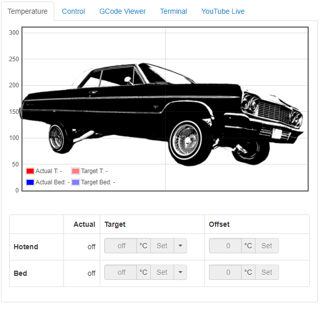
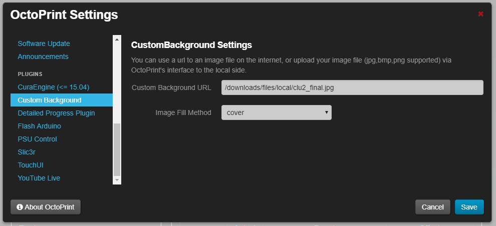

# OctoPrint-M117PopUp

Octoprint plugin to send M117 gcode messages to OctoPrint's built in alerting system.

Note: this plugin does NOT work with files on the SD card.

###Setup

Install via the bundled Plugin Manager or manually using this URL:

https://github.com/jneilliii/OctoPrint-M117PopUp/archive/master.zip

###Changelog

* Version 0.6.0 released 12/24/2016
  * updated configuration model from the deprecated 3 tuple method.

* Version 0.5.0 released 09/25/2016
  * added settings interface
  * new settings
    * Message Type: [type](https://sciactive.com/pnotify/#demos-simple) to be used for PNotify parameters.
    * Auto Close: if enabled pop up will disappear after a period of time.	